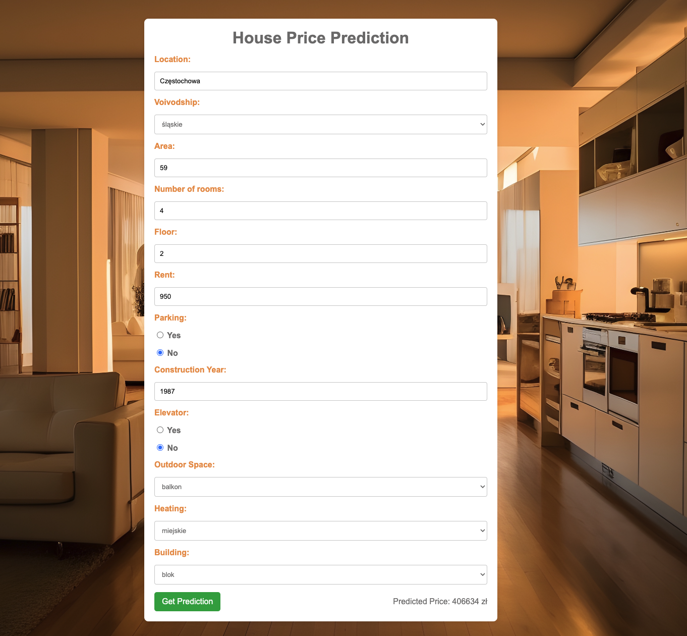

# House price predicting
### ML Web Application - Predicting the price of a house with neural network

## Objective
In real life, estimating the price of a property for sale can be challenging due to the uniqueness of each home, unlike cars which often have more comparable features. 
This application uses a **Machine Learning model** to provide an estimated market price for a house based on its attributes, helping users better understand its market value.

## Algorithm
- I scraped **57,000 rows of data from the most popular website with house sales offers in Poland www.otodom.pl**
- The data was cleaned and processed for predictive modeling
- Tested multiply regression models, such as **Linear, Ridge, KNN, Decision Tree, Random Forest, XGBoost, Neural Network with 4 Dense layers**
- Built the app's front-end using **JavaScript and HTML** and back-end using **FastAPI**

## Usage example

## Data Description
- Location: location of the property (city, village, etc.)
- Voivodship: voivodeship where the apartment is located
- Area: total area of the property in square meters
- Number of Rooms: count of rooms in the property
- Floor: floor number on which the property is situated
- Rent: monthly rent for the property (costs associated with building administration and maintenance)
- Parking: availability of parking (True/False)
- Construction Year: year the building was constructed
- Elevator: availability of an elevator in the building (True/False)
- Outdoor Space: availability of outdoor space like a balcony or garden
- Heating: type of heating system used in the property
- Building Type: type of building

## Results and Achievements:
The Neural Network model with 4 Dense layers and 1024->512->256->1 neurons respectively achieved the best performance with the following results:
- R² Score: 0.83
- Root Mean Squared Error (RMSE): 89693
- Mean Absolute Error (MAE): 65282

Unfortunately, these results are saturation points in the performance of the model. Changing model architecture or hyperparameter tuning leads to overfitting on the train set, but doesn't improve test score

## Future Improvements
Feature engineering and selection could improve prediction robustness 

## Summary
This project is a **web application** that predicts house prices using a neural network model trained on 57,000 property listings from otodom.pl. 
Built with **FastAPI** for the back-end and **JavaScript/HTML** for the front-end, the model achieved an **R² score of 0.83**.
